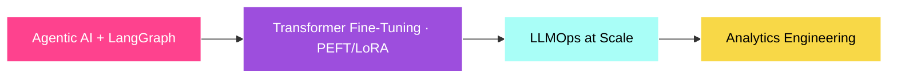

<!-- ═══════════════════════════════════════════════════════════════════════════
     HARISH KUMAR UTA · GITHUB PROFILE README
     Theme: Neon (magenta #FE428E · cyan #A9FEF7 · ink #0D1117)
     Every section is marked with an HTML comment for easy editing.
════════════════════════════════════════════════════════════════════════════ -->

<!-- ============================= HEADER / BANNER ============================= -->
<div align="center">


<!-- TYPING ANIMATION -->
<a href="https://harish-uta17.github.io/my-portfolio/">
  
</a>

<p><em>I build AI-powered applications, scalable backends, and data-driven systems<br/>that turn messy business processes into intelligent, automated workflows.</em></p>

<!-- SOCIAL BUTTONS -->
<a href="https://www.linkedin.com/in/utaharishkumar/"></a>
<a href="https://harish-uta17.github.io/my-portfolio/"></a>
<a href="https://github.com/Harish-Uta17"></a>
<a href="mailto:utaharish96@gmail.com"></a>

<br/><br/>


</div>

<!-- ============================= QUICK STATS STRIP ============================= -->


<div align="center">
  
  
  
  
</div>

<!-- ============================= ABOUT ME ============================= -->
## 👨‍💻 About Me


```python
class HarishKumarUta:
    def __init__(self):
        self.role   = "AI Engineer · Data Scientist"
        self.study  = "B.Tech AI @ Parul IET"
        self.focus  = ["Agents", "RAG", "Fine-Tuning", "ML"]
        self.exp    = "4 internships · DS / ML / Analytics"
        self.fact   = "100% High School · 98% Intermediate"

    def goal(self):
        return "Ship production-grade agentic AI 🚀"
```

- 🎓 **Final-year B.Tech (Artificial Intelligence)** — Parul Institute of Engineering & Technology
- 🤖 I build **multi-agent systems, RAG pipelines, fine-tuned Transformers**, and predictive DS models
- 💼 **4 internships** across Data Science, ML & Business Analytics — turning data into operational strategy
- ⚡ **Fun fact:** consistency is my superpower — 100% in High School, 98% in Intermediate

<br clear="right"/>

<!-- ============================= TECH STACK ============================= -->


## 🛠️ Tech Stack & Ecosystem

<div align="center">

**🤖 Generative AI · Agents · LLMs**


**🧠 Data Science · ML · Deep Learning**


**📊 Analytics · Visualization**


**⚙️ Automation · Backend · Infra**


</div>

<!-- ============================= GITHUB STATS ============================= -->


## 📊 GitHub Command Center

<div align="center">


</div>

<!-- ============================= FEATURED PROJECTS ============================= -->


## 🚀 Featured Projects

| Project | What it does | Stack | Link |
| :--- | :--- | :--- | :---: |
| 🩺 **HCP CRM Assistant** | AI-first Healthcare CRM logging HCP interactions via NLP through a stateful 5-tool LangGraph workflow | `React` `FastAPI` `LangGraph` `SQLite` `Gemini` | [🔗](https://github.com/Harish-Uta17/smart-hcp-logger) |
| 🤖 **AI Learning Path Generator** | Builds personalized roadmaps, writes Google Docs, schedules Calendar blocks, fetches live resources | `n8n` `Gemini` `Docs API` `SerpAPI` | [🔗](https://github.com/Harish-Uta17) |
| 📰 **AI News Summarizer** | Filters tech RSS, summarizes with LLMs, and auto-dispatches a newsletter via Gmail | `n8n` `Gemini` `Gmail API` `RSS` | [🔗](https://github.com/Harish-Uta17) |
| 📢 **AI Social Automation** | Turns spreadsheet insights into scheduled, curated posts for distribution channels | `n8n` `Gemini` `Sheets` `LinkedIn API` | [🔗](https://github.com/Harish-Uta17) |
| 📊 **Sales Performance Dashboard** | Interactive BI pipeline over 50,000+ transactions for executive KPIs | `Tableau` `SQL` `Excel` | [🔗](https://github.com/Harish-Uta17) |
| 📈 **Customer Churn Prediction** | Predictive classification minimizing attrition via trait segmentation | `Python` `scikit-learn` `XGBoost` | [🔗](https://github.com/Harish-Uta17) |

<details>
<summary>🔎 <b>Deep-dive into each project</b></summary>

<br/>

- **🩺 HCP CRM Interaction Assistant** — A stateful LangGraph workflow across five functional tools handling field extraction, contextual edits, validation, and automated summary tracking end-to-end.
- **🤖 AI Learning Path Generator** — Populates dedicated Google Docs, schedules custom Calendar blocks, and orchestrates live resource retrieval via SerpAPI.
- **📰 AI News Summarization Agent** — Monitors target tech RSS feeds, aggregates sector updates, summarizes them, and dispatches compiled newsletters automatically.
- **📢 AI Social Automation Agent** — Structures raw, spreadsheet-managed insights into curated, text-driven visual updates for distribution channels.
- **📊 Sales Performance Analytics Dashboard** — Enterprise BI pipeline parsing 50,000+ corporate transactional nodes for high-level KPI presentation.
- **📈 Customer Churn Prediction System** — High-impact predictive classification pipeline helping minimize user attrition.

</details>

<!-- ============================= CERTIFICATIONS ============================= -->


## 🏆 Certifications & Achievements

<div align="center">

| 🏅 Credential | Issuer |
| :--- | :--- |
| **Oracle Certified Professional** | Oracle — Data Science |
| **Data Science Professional Certificate** | IBM |
| **SQL (Advanced)** | HackerRank |
| **Production AI & Automation Systems** | Multiple end-to-end deployments |

</div>

<!-- ============================= CURRENTLY EXPLORING ============================= -->


## 🌱 Currently Exploring



- 🧩 **Agentic AI & LangGraph** — complex stateful orchestration
- 🔬 **Transformer fine-tuning (PEFT / LoRA)** — domain-specific LLMs
- 📦 **LLMOps** — productionalizing large models at scale
- 🔗 **Analytics engineering** — bridging backend storage with visualization

<!-- ============================= FOOTER ============================= -->


<div align="center">

### 💬 Let's build something intelligent together

<a href="https://www.linkedin.com/in/utaharishkumar/"></a>
<a href="mailto:utaharish96@gmail.com"></a>

<em>"Turning ideas into intelligent software through AI, backend engineering, and data."</em>


</div>
